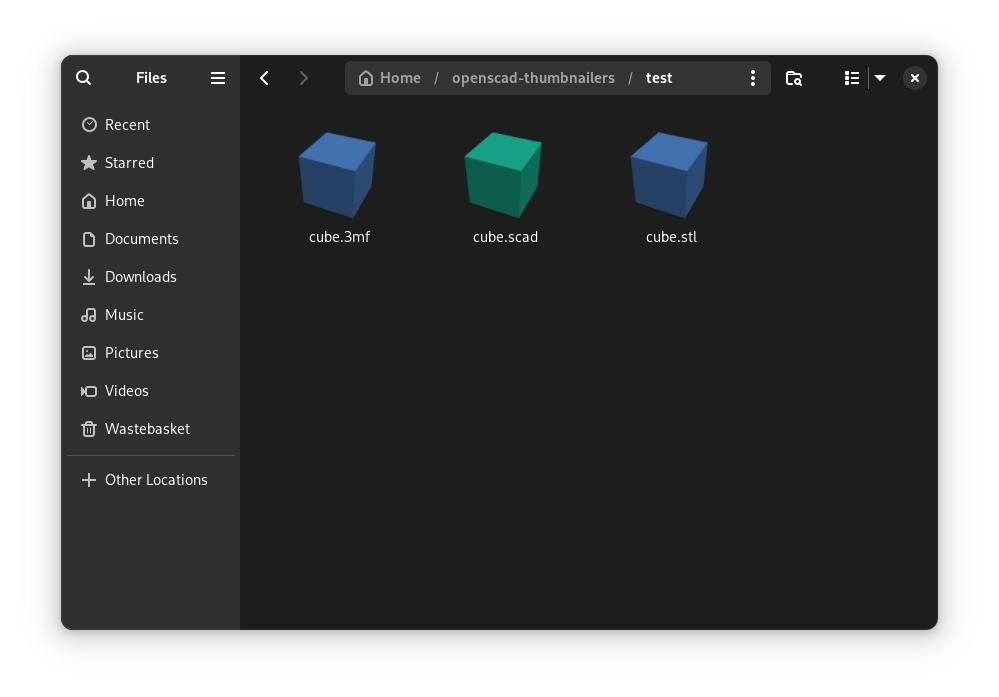

# Openscad thumbnailers

GTK thumbnailers for .scad, .stl and .3mf files.



This project allows most GTK file managers (Nautilus, Nemo, Caja and PCManFM-gtk) to show thumbnails for `.stl`, `.scad` and `.3mf` files.

It also **works with Nautilus>=3.28**, which introduced thumbnailers sandboxing with bubblewrap.

## Requirements

* openscad
* imagemagick
* Xvfb

In Fedora they can be installed with the following command:

```bash
sudo dnf install openscad ImageMagick xorg-x11-server-Xvfb
```

## Installation

### Arch Linux
There is an AUR package https://aur.archlinux.org/packages/openscad-thumbnailers

You can install it using your favourite aur helper:
```bash
yay -S openscad-thumbnailers
```

### Other
Clone the repo and run the install.sh file

```bash
git clone https://github.com/georgewoodall82/openscad-thumbnailers
cd openscad-thumbnailers
sudo bash install.sh
```
